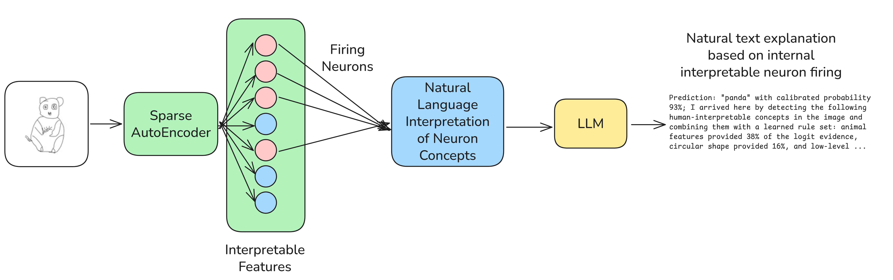

## Self-Explaining Classifiers with Sparse Autoencoders and LLMs

Turn an ordinary classifier into a self-explaining system. This project trains a standard classifier, learns a Sparse Autoencoder (SAE) on one of its later feature maps, summarizes each SAE neuron into a human concept, and uses those concepts to explain any single prediction in natural language.


The pipeline is fully implemented in these five scripts:

- `train_standard_cnn.py`: trains a sketch classifier (ResNet-18 variant) on the TU-Berlin sketches dataset and saves a best checkpoint.
- `train_sae.py`: trains a token-space Top‑K Sparse Autoencoder on a later convolutional feature map of the frozen classifier.
- `sae_summarize.py`: computes rich, per‑neuron concept statistics (activation thresholds, PMI vs class, logit-lens, closed‑form causal scores) and exports thumbnails and JSON lines.
- `sae_summary_to_llm.py`: converts each neuron’s numeric summary into a short human‑readable concept using an LLM.
- `why_did_you.py`: explains “why” the classifier picked a class for a given image by reading the image’s top-activating SAE neurons and assembling their human concepts.



## Quickstart

### 1) Environment

Python 3.10+ recommended. Install dependencies (PyTorch per your CUDA/OS):

```bash
pip install torch torchvision --index-url https://download.pytorch.org/whl/cu121  # adjust for your CUDA/OS
pip install pillow pyarrow pandas tqdm tensorboard huggingface_hub pyyaml replicate python-dotenv
```

Notes:
- Windows is supported for single‑GPU or CPU. Multi‑GPU distributed training is best on Linux.
- TensorBoard is optional but recommended for training curves.


### 2) Train the classifier (`train_standard_cnn.py`)

This script trains a ResNet‑18 adapted to 1‑channel sketches and will auto‑download the TU‑Berlin parquet dataset to `TrainConfig.data_root` if missing. Edit the defaults inside the file if needed (e.g., `data_root`, `output_dir`).

Run:
```bash
python train_standard_cnn.py
```

Outputs (under `runs/standard_cnn/`):
- `best.pt`: best checkpoint (contains model weights, preprocessing stats, and config).
- `tensorboard/`: logs for loss/accuracy and feature stats.

Tips:
- On Windows, the script automatically uses `num_workers=0` for dataloaders to avoid spawn issues.
- With >1 GPU on Linux, the script can launch Distributed Data Parallel training automatically.


### 3) Train the Sparse Autoencoder (`train_sae.py`)

This script loads the frozen classifier checkpoint and trains a Top‑K SAE on the classifier’s last convolutional feature map. Configure paths at the top:

```python
# in train_sae.py
checkpoint_path = "runs/standard_cnn/best.pt"
data_dir = r"F:\\TuBerlin"  # set to where your parquet data lives
```

Run:
```bash
python train_sae.py
```

Outputs (under `runs/sae_topk/`):
- `best_sae.pt` and `last_sae.pt`: SAE weights and metadata, including feature means/stds.


### 4) Build per‑neuron summaries (`sae_summarize.py`)

This script computes, for every neuron, activation statistics, per‑class associations (PMI), logit‑lens alignment with the classifier head, a closed‑form knockout effect, and exports top example thumbnails.

Configure paths at the top if needed, then run:
```bash
python sae_summarize.py
```

Outputs (under `neuron_report/`):
- `neurons.jsonl`: one JSON object per neuron with all stats and a concise auto‑summary.
- `sprites/` and `thumbs/`: images of top‑activating examples.


### 5) Turn neuron stats into short concepts with an LLM (`sae_summary_to_llm.py`)

This script converts each neuron’s numeric profile into a short, human‑readable concept using an LLM via the Replicate API.

Setup:
```bash
setx REPLICATE_API_TOKEN "<your_replicate_api_token>"   # PowerShell/Windows
# or export REPLICATE_API_TOKEN=<your_token>             # bash
```

Run:
```bash
python sae_summary_to_llm.py
```

Output:
- `neuron_report/llm_output.jsonl`: `{neuron_id, answer}` pairs with concise neuron concepts.


### 6) Ask the model “Why did you choose that class?” (`why_did_you.py`)

Point the script to an input image (grayscale is expected), then run:
```bash
python why_did_you.py
```

The script:
- Finds the top‑activating SAE neurons for the image.
- Fetches their human concepts from the LLM output.
- Prints a compact, human‑readable explanation of the prediction.


## How it works (math + implementation)

### Notation

- A later convolutional feature map of the frozen classifier is denoted by \(A\in\mathbb{R}^{B\times C\times H\times W}\).
- We reshape spatial tokens: \(a\in\mathbb{R}^{N\times C}\) where \(N=B\cdot H\cdot W\).
- We standardize per channel using feature statistics \(\mu,\sigma\in\mathbb{R}^C\): \(\tilde a=(a-\mu)\oslash\sigma\).


### Top‑K Sparse Autoencoder (token space)

The encoder/decoder operate on standardized tokens \(\tilde a\):

- Encoder pre‑activation: \(s = W_e\,\tilde a + b_e\) where \(W_e\in\mathbb{R}^{M\times C}\).
- Nonlinearity: \(r=\text{ReLU}(s)\).
- Top‑K sparsity: keep the \(K\) largest entries per token to get sparse code \(z\in\mathbb{R}^M\), zero the rest.
- Decoder (columns unit‑normalized): \(\hat a = D\,z + b_d\) with \(D\in\mathbb{R}^{C\times M}\).

Training minimizes MSE token reconstruction: \(\mathcal{L} = \lVert \hat a - \tilde a\rVert^2\).

Implementation highlights:
- `train_sae.py` maintains an EMA of neuron usage to resample “dead” latents by resetting their decoder atoms to random tokens and aligning encoder rows. Decoder columns are re‑normalized after each step.
- During analysis (`sae_summarize.py` and `why_did_you.py`), we often use a dense ReLU code \(z=\text{ReLU}(W_e\tilde a+b_e)\) (no Top‑K) to measure analog activation strength; aggregation across spatial tokens uses max or mean.


### Linking SAE directions to class logits (logit‑lens)

The classifier’s final head is linear: \(\text{logits} = W_{out}\,p + b\), where \(p\) is a pooled feature and \(W_{out}\in\mathbb{R}^{K\times C}\).

Decoder directions live in standardized feature space. To map a decoder column \(d_i\) to the classifier’s unstandardized space, unscale by the feature stds: \(d_i^{\text{unstd}} = d_i \odot \sigma\).

The logit contribution direction for neuron \(i\) is then:
\[ w_i = W_{out}\,d_i^{\text{unstd}} \in \mathbb{R}^{K}. \]

`sae_summarize.py` computes all \(w_i\) efficiently.


### Closed‑form causal knockout (Δ⁻)

If the head is linear, ablating a neuron’s contribution approximates a logit change without a forward pass. Let \(\bar z_i\) be the mean dense activation of neuron \(i\) over images of class \(c\) (or over images where the neuron is “on”). Then the class‑\(c\) logit change from removing neuron \(i\) is approximately
\[ \Delta^-_i(c) \approx -\,\bar z_i\,\cdot\, w_i[c]. \]

`sae_summarize.py` computes \(\bar z_i\) from cached activations and reports \(\Delta^-\) for the top‑relevant and a few random control classes.


### Per‑class association via PMI

For each neuron \(i\), we define an “on/off” indicator by thresholding its per‑image activation at a high quantile (e.g., \(q=0.99\)). With Laplace smoothing \(\lambda\),
- \(P(c)\): empirical class frequency.
- \(P(c\mid I_i{=}1)\): class probability conditioned on neuron \(i\) being on.

The pointwise mutual information is
\[ \text{PMI}_i(c) = \log \frac{P(c\mid I_i{=}1)}{P(c)}. \]

We z‑score PMI, z‑score the knockout \(\Delta^-\), and z‑score \(w_i\) across classes, then combine them into a ranking score \(S_i(c)\). `sae_summarize.py` exports the top classes per neuron using this score.


### From numbers to words, and then to explanations

1) `sae_summary_to_llm.py` turns each neuron’s stats into a short concept (“open circle”, “zig‑zag edge”, …). It produces a JSON lines file mapping `neuron_id → concept`.

2) `why_did_you.py` takes an image, computes its top‑activating neurons, looks up their concepts, prints the model’s top‑5 class confidences, and emits a one‑sentence “why” summary.


## Minimal code examples

Use the “why” function directly to find salient neurons for an image:

```python
from why_did_you import top_neuron_ids_for_image

ids, scores, thr, pred_cls, pred_prob, top5 = top_neuron_ids_for_image(
    pil_or_path="path/to/your/grayscale.png",
    classifier_ckpt="runs/standard_cnn/best.pt",
    sae_ckpt="runs/sae_topk/best_sae.pt",
    N=20,
    percentile=99.0,
    agg="max",
)

print(pred_cls, pred_prob)
for nid, sc in zip(ids, scores):
    print(nid, sc)
```


## Tips and troubleshooting

- Dataset path: ensure the parquet dataset directory you want is reachable by the scripts (edit the path variables near the top of the files if needed).
- GPU memory: reduce batch sizes (`batch_size` for classifier; `per_gpu_imgs` and `chunk_sz` for SAE) if you hit OOM.
- Windows: prefer single‑GPU. If you have multiple GPUs on Windows, force single‑GPU (e.g., by restricting visible devices) to avoid NCCL issues.
- LLM API: ensure your Replicate API token is available in the environment before running the LLM step.


## What you should see at the end

After all steps, you should have:
- A trained classifier checkpoint and logs.
- A trained SAE with feature stats.
- Per‑neuron reports (JSONL + sprites/thumbnails).
- A compact concept for each neuron from the LLM.
- Explanations for individual images that read as short, human‑understandable “reasons” for the prediction.


## Files overview (only these five)

- `train_standard_cnn.py`: data transforms, dataset IO (parquet), ResNet‑18 variant for sketches, cosine LR schedule, AMP/grad‑accum, best‑checkpoint saving, feature stats logging, TensorBoard.
- `train_sae.py`: frozen backbone features → standardized tokens → Top‑K SAE training with usage‑EMA, decoder re‑norm, and dead‑unit resampling.
- `sae_summarize.py`: caches dense neuron activations, computes thresholds, PMI, logit‑lens \(W_{out} d_i^{\text{unstd}}\), and closed‑form \(\Delta^-\); exports JSONL + images.
- `sae_summary_to_llm.py`: converts neuron stats into short natural‑language concepts with an LLM.
- `why_did_you.py`: for a given image, surfaces the top neurons, their scores, top‑5 class confidences, and prints an overall explanation.


